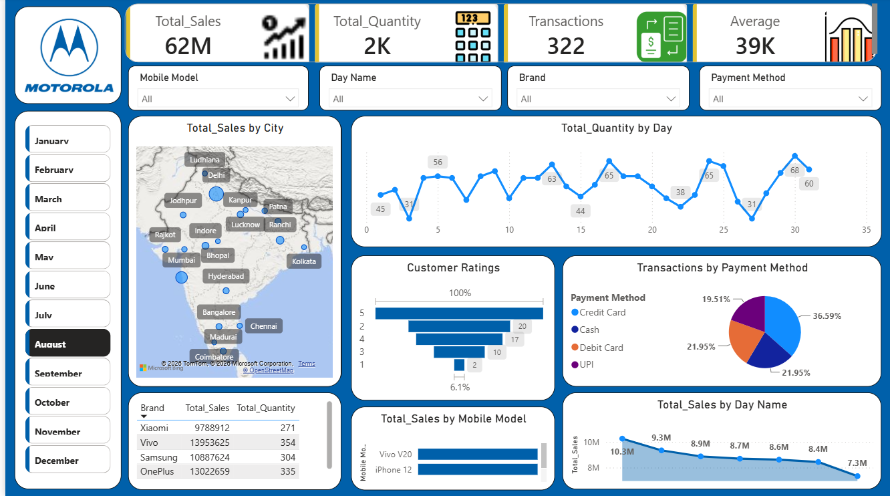

# 📱 Mobile Sales Analysis Dashboard | Power BI

## 📌 Project Overview

This project presents an interactive **Mobile Sales Analysis Dashboard** developed using Microsoft Power BI.

The dashboard transforms mobile sales transaction data into meaningful business insights by analyzing sales performance across cities, mobile brands, mobile models, payment methods, customer ratings, and time-based trends.

The primary objective of this project is to demonstrate how Power BI can be used to transform raw sales data into an interactive and business-focused reporting solution.

---

## 🎯 Business Objectives

- Analyze overall mobile sales performance
- Track key sales and transaction KPIs
- Analyze sales performance across different cities
- Compare mobile brands and models
- Understand customer rating distribution
- Analyze transactions by payment method
- Identify daily and monthly sales patterns
- Provide interactive filtering for detailed analysis
- Build a user-friendly dashboard for business reporting

---

## 🛠️ Tools & Technologies

- **Microsoft Power BI**
- **Power Query**
- **DAX**
- **Data Modeling**
- **Data Transformation**
- **Data Visualization**
- **Interactive Dashboard Design**

---

## 📊 Key KPIs

The dashboard provides the following key performance indicators:

- **Total Sales:** 62M
- **Total Quantity:** 2K
- **Total Transactions:** 322
- **Average Sales:** 39K

> KPI values shown above represent the dashboard view used in this project.

---

## 🔍 Analysis Performed

### 1. Sales Analysis

Analyzed overall sales performance using key metrics such as total sales, total quantity, transactions, and average sales.

### 2. City-wise Sales Analysis

Visualized sales performance across different cities to understand geographical sales distribution.

### 3. Brand Analysis

Compared sales and quantity across different mobile brands to understand brand-level performance.

### 4. Mobile Model Analysis

Analyzed sales performance across individual mobile models to identify differences in model-level performance.

### 5. Payment Method Analysis

Analyzed transactions based on different payment methods such as:

- Credit Card
- Cash
- Debit Card
- UPI

### 6. Customer Rating Analysis

Visualized customer ratings to understand the distribution of customer feedback.

### 7. Time-based Analysis

Analyzed sales and quantity trends across:

- Months
- Days
- Day Names

This helps identify variations in sales performance over time.

---

## 📊 Dashboard Features

The interactive Power BI dashboard includes:

- KPI Cards
- City-wise Sales Map
- Daily Quantity Trend
- Customer Rating Analysis
- Payment Method Distribution
- Brand-wise Sales Analysis
- Mobile Model Sales Comparison
- Day-wise Sales Analysis
- Month-wise Navigation
- Mobile Model Slicer
- Day Name Slicer
- Brand Slicer
- Payment Method Slicer

---

## 🎛️ Interactive Filters

Users can dynamically filter the dashboard using:

- **Mobile Model**
- **Day Name**
- **Brand**
- **Payment Method**
- **Month**

These filters allow users to explore the sales data from different perspectives.

---

## 💡 Key Insights

- The dashboard reports total sales of approximately **62M** across **322 transactions**.
- The total quantity sold is approximately **2K**, with an average sales value of around **39K**.
- Among the brands displayed, **Vivo recorded the highest total sales**, followed by **OnePlus**.
- Sales performance varies across different cities, indicating differences in geographical demand.
- Transaction analysis shows the distribution of customer purchases across **Credit Card, Cash, Debit Card, and UPI** payment methods.
- Customer ratings range from **1 to 5**, providing visibility into customer satisfaction patterns.
- Daily and monthly analysis helps identify variations in sales and quantity over time.
- The interactive filters allow users to analyze performance by **month, mobile model, brand, day name, and payment method**.

---

## 📸 Dashboard Preview

---

## 📁 Project Files

| File | Description |
|------|-------------|
| `Mobile-Sales-Analysis.pbix` | Complete Power BI dashboard and data model |
| `Mobile-Sales-Dashboard.png` | Dashboard preview image |
| `README.md` | Project documentation |

---

## 🚀 Project Workflow

The project followed an end-to-end data analytics workflow:

**Raw Data → Data Transformation → Data Modeling → DAX Calculations → Visualization → Interactive Dashboard → Business Insights**

---

## 📚 Skills Demonstrated

- Data Cleaning & Transformation
- Power Query
- DAX
- Data Modeling
- KPI Development
- Data Visualization
- Dashboard Design
- Interactive Filtering
- Business Analysis
- Sales Performance Analysis

---

## 🔮 Future Improvements

The dashboard can be further enhanced by adding:

- Year-over-Year sales comparison
- Profit and profit margin analysis
- Sales forecasting
- Customer segmentation
- Advanced drill-through pages
- Additional time-intelligence measures
- Automated data refresh

---

## 👩‍💻 Author

**Yogita Nagar**

Aspiring Data Analyst  
Skills: SQL | Python | Excel | Power BI

---

## ⭐ Project Purpose

This project was developed as part of a practical **Data Analytics portfolio** to demonstrate the ability to analyze sales data and build interactive business intelligence dashboards using Power BI.
